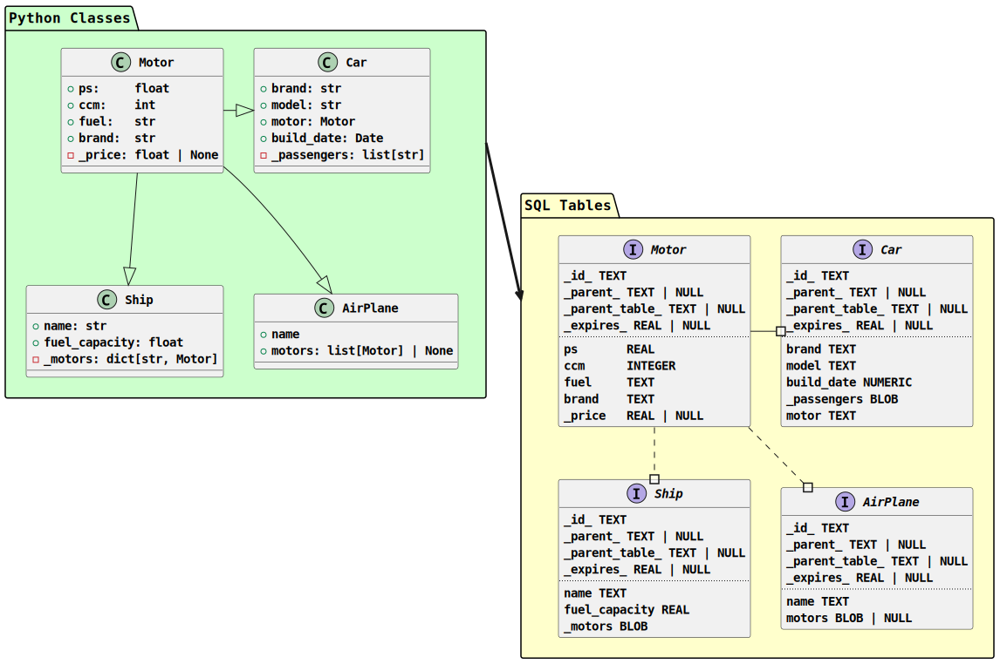

# PyODB


[](https://codecov.io/gh/NeoSecundus/PyODB)


Python Object DataBase (PyODB) is a SQLite3 ORM library aiming to be as simple to use as possible.
This library is supposed to be used for testing, in small projects, when wanting to export complex
python data in a well structured format or for local inter-process data caching.

**Basics:**

- PyODB uses the python built-in SQLite3 implementation as database and has no external dependencies.
- PyODB can take any (non-primitive) type you pass into it, extracts its members and creates a
  database schema representing the type. Sub-types of the main type are also extracted recursively.
- Saves instances of known types into the database and loads them using basic filtering options.
- Also provides a caching module 'PyODBCache' which may be used for inter-process data caching.
  > When using multiprocessing excessively race conditions may occur.
- All data (cache & non-cache) can persist or be deleted upon closing of the process.

1. [Setup](#setup)
2. [Basic Usage](#basic-usage)
   1. [More in-depth examples](#more-in-depth-examples)
3. [Limitations](#limitations)
4. [How it works](#how-it-works)
   1. [Converting Primitive Types](#converting-primitive-types)
   2. [Converting Custom Types](#converting-custom-types)
      1. [Simple custom type](#simple-custom-type)
      2. [Custom types contained in a collection or dict](#custom-types-contained-in-a-collection-or-dict)
   3. [Dynamic type definitions](#dynamic-type-definitions)

## Setup

There are two main ways to install the package. The simplest version is using pip:

```bash
pip install pyodb
```

Since there are no external dependencies this should work without problem.

Another way is to install the package from source. To do this you have to pull or download this
repository and move into the package folder. Once inside the folder you can install the package:

```bash
pip install .
```

## Basic Usage

A very basic usage example is using the library to save a simple custom type and load it elsewhere.

To do this a custom class with some members is needed. We will use the example class below:

```python
class MyType:
    some_data: list[str]
    some_number: int | None

    def __init__(self, number: int):
        self.some_data = ["Hello", "World"]
        self.some_number = number

    def __repr__(self) -> str:
        return f"MyType Number: {self.some_number}"
```

Next you can simply import pyodb and add MyType and try saving some instances:

```python
from pyodb import PyODB

# Create PyODB instance with persistent data and type-definitions
pyodb = PyODB(persistent=True)

# Add type and save some instances
pyodb.add_type(MyType)
pyodb.save(MyType(1))
pyodb.save_multiple([MyType(2), MyType(3), MyType(4), MyType(5)])
```

Now let's say you need the data in another process or in another python program altogether.

Create a new instance - types are re-loaded from the database since persistent was set to True
> This time, when the process exits, the data will be deleted because persistent is False by default

```python
pyodb = PyODB()
```

Now you can get a Selector instance which is used to select and filter data loaded from the database.

```python
select = pyodb.select(MyType)

## filter loaded instances by some_number > 2
select.gt(some_number = 2)

## Load results into result
result = select.all()
print(result)

```

The same select can also be written as a one-liner.

```python
result = pyodb.select(MyType).gt(some_number = 2).all()
print(result)
```

You can easily delete some saved entries with the Deleter using filters like the Selector.


```python
deleted = pyodb.delete(MyType).gt(some_number = 2).commit()
print(f"Deleted {deleted} entries")

# Count remaining entries
count = pyodb.select(MyType).count()
print(f"{count} entries remaining")
```

You can also scrap all data from the database keeping the table definitions using `clear()`.

```python
pyodb.clear()
```

Known types can also be shown and removed.
Removing types does have some restrictions. For more information look at the [PyODB Examples](./docs/PyODBExamples.md).

```python
print(pyodb.known_types)
pyodb.remove_type(MyType)
print(pyodb.known_types)
```

As you can see loading and removing data is quite simple. Basic filtering is also possible in both
select and delete.

### More in-depth examples

Below are links to two documents containing more comprehensive examples of different functions.
They also contain best practices regarding performance and some possible error cases.

For PyODB examples please refer to [PyODB examples](./docs/PyODBExamples.md)

For PyODBCache examples please refer to [Caching examples](./docs/PyODBCacheExamples.md)

## Limitations

What this library can store:

- Primitive Datatypes (int, float, str, bool)
- Lists
- Dictionaries
- Custom Types

What this library cannot store:

- Fields containing functions (maybe in the future...)
- Fields that are dependent on external states or state changes

**Important Notice:**

Storing of types imported from external libraries should be avoided.
Depending of how deep an library type is nested one single datapoint could lead to the creation of
dozens of tables. One for every nested sub-type. Additionally there may be some fields containing
stateful connections or other illegal members.

As example -> Storing a `PoolManager` from `urllib3` would result in these tables:
- PoolManager
- Url
- ProxyConfig
  - SSLContext
    - SSLObject
    - SSLSocket
      - SSLSession
      - ...
- ConnectionPool
  - LifoQueue
    - Queue
    - ...

This is still a very basic example. As a rule of thumb; The higher level the library the deeper the
objects are nested on average.

To prevent this the **max recursion depth** should not be set above 3. Using more than this is
discouraged because of performance reasons as well. You can also exclude certain members by
defining the `__odb_members__` dict containing all wanted class members.

## How it works

When a python class is added to the PyODB schema the classes are converted to SQL Tables and
inserted into the database schema.

> IMPORTANT: If a class changes between executions the table retains the old definition.
> It is advisable to reset the database manually in case it was persisted.

The UML Diagram below shows what such a conversion looks like:



### Converting Primitive Types

Primitive python datatypes are simply converted to SQL datatypes.

| SQL Datatype | Python Datatypes |
|-----------------|--------------|
| INTEGER | int |
| REAL | float |
| NUMERIC | bool |
| TEXT | str |
| BLOB (pickled) | bytes, list, dict, tuple, set |

### Converting Custom Types

There is a certain amount of scenarios when converting custom types. Below is a list of
all handled scenarios and the corresponding rules that deal with them. All of these scenarios are
also depicted in the example diagram above.

Henceforth Origin references the original class whose type is parsed into a SQL Table.

#### Simple custom type

When a simple custom type is contained by the Origin a table is created for the sub-type as
well. The sub-type's table uses a `_parent_` column which references the `_id_` of the
Origin and a `_parent_table_` column referencing the type/table-name of the Origin.

When an Origin instance is inserted the sub-type instance is saved in it's own table. The table
which the instance is saved in is then referenced by the Origin's sub-type column. As example:

Here are the columns of an imaginary origin type:

|Column Name| Type | Content |
|-----------|------|---------|
| \_id_     | TEXT | OriginID |
| subtype   | TEXT | MySubType |

And here are the columns of the imaginary sub-type:

|Column Name| Type | Content |
|-----------|------|---------|
| \_parent_   | TEXT | OriginID |
| \_parent_table | TEXT | Origin |

#### Custom types contained in a collection or dict

Because of performance considerations and to keep my sanity all collection types and dicts are
converted to `bytes` objects via pickle and then saved to the Database as BLOBs.

Collections and dicts can therefore not be loaded by other programs besides python unlike all other
datatypes.

### Dynamic type definitions

Dynamic type definitions (Union) of custom types can also be saved by PyODB.
Only primitive datatypes must be unambiguous.

The only exception is None. Data may always be defined with None as an option.

**This is allowed:**

```python
class Person:
    name: str
    dob: int
    info: str | None
    card: CreditCard | Bankcard
```

**This is not:**

```python
class Square:
    length: int | float
```

**Important Notice:**
A table will be created for every possible Datatype!
